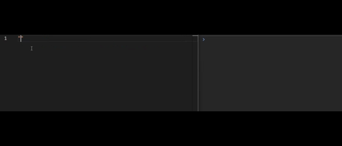

<<<<<<< HEAD
# Quick Log

Insert console.log quickly in JavaScript or React projects.

## Features

- Add `console.log` with a shortcut (Ctrl+Alt+L)
- Works in JavaScript and React files

## Usage

1. Open a JS/TS file.
2. Press `Ctrl+Alt+L` to insert a log.
=======
# Quick Log Plus

Insert colored `console.log` statements fast in JavaScript and TypeScript.


## Features

- Replaces a keyword with a styled `console.log`.
- Adds color to console output.
- Works with strings and variables.
- Runs on space trigger.
- Speeds up debugging.

## Color Keywords

| Keyword | Color        |
|--------|--------------|
| glog   | green        |
| blog   | blue         |
| rlog   | red          |
| wlog   | white        |
| plog   | purple       |
| slog   | silver       |
| alog   | aqua         |
| hlog   | deeppink     |
| jlog   | yellow       |
| ilog   | indigo       |
| ulog   | ultramarine  |
| tlog   | teal         |
| klog   | khaki        |
| nlog   | navy         |
| elog   | emerald      |
| xlog   | coral        |
| ylog   | gold         |
| zlog   | cyan         |
| qlog   | crimson      |

## How it works

Type a value and then a keyword with a space:

```ts
"d" glog
myVar blog
error rlog
info wlog
status ylog
>>>>>>> f4df3be7d4366b98aa3273bdfb4a19a2279c3923
