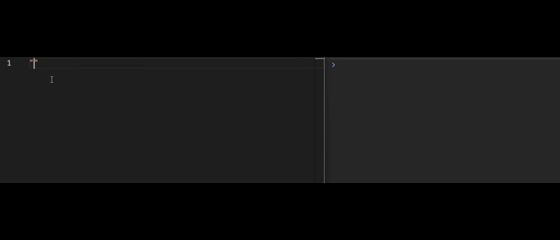

# Quick Log Plus

<<<<<<< HEAD
Insert colored `console.log` statements fast in JavaScript and TypeScript.


=======
Insert smart, colorful, context-aware log statements in **JavaScript, TypeScript, Python, Go, PHP, C# and Java** — and clean them all up again with a single command.


>>>>>>> 827ca7b (Refactore codes)

## Features

- 🚩 **Context-aware logs** — every generated statement can include the file name, line number, and the name of the enclosing function, so you always know where a log came from.
- 🌈 **Colorful by default** — JavaScript/TypeScript logs use styled `console.log` output; pick a color with a keyword, or let Quick Log auto-assign a consistent color per variable.
- 🌍 **Multi-language** — works in JavaScript, TypeScript, JSX/TSX, Python, Go, PHP, C#, and Java.
- ⌨️ **Two ways to insert** — the classic space-triggered keyword shortcut (JS/TS), or `Ctrl+Alt+L` / right-click "Quick Log" for any supported language, including multi-cursor selections.
- 🧹 **One-click cleanup** — comment out, uncomment, or delete every quick-log statement in the current file.
- ⚙️ **Fully configurable** — marker, quote style, semicolons, and which context details to show.

<<<<<<< HEAD
---

## Color Keywords

| Keyword | Color       |
|---------|------------|
| glog    | green      |
| blog    | blue       |
| rlog    | red        |
| wlog    | white      |
| plog    | purple     |
| slog    | silver     |
| alog    | aqua       |
| hlog    | deeppink   |
| jlog    | yellow     |
| ilog    | indigo     |
| ulog    | ultramarine|
| tlog    | teal       |
| klog    | khaki      |
| nlog    | navy       |
| elog    | emerald    |
| xlog    | coral      |
| ylog    | gold       |
| zlog    | cyan       |
| qlog    | crimson    |

---

## Samples

| Input Example | Output              |
|---------------|-------------------|
| `msg glog `   | 🟢 msg result is → |
| `msg blog `   | 🔵 msg result is → |
| `msg rlog `   | 🔴 msg result is → |
| `msg wlog `   | ⚪ msg result is → |

---

## 🚀 How it works

1. Type a value, then a keyword.
2. Press the console key.
3. **Add a space** at the end to trigger the log.

> [!WARNING]
> **Important:** Make sure to include a space at the end of the log, and do not press any key other than the space.
=======
## Usage

### 1. Command / right-click (any supported language)

Select an expression (or just place the cursor on a variable) and press `Ctrl+Alt+L`, use the Command Palette (`Quick Log: Insert Log Statement`), or right-click → **Quick Log** → **Insert Log Statement**. Works with multiple cursors/selections at once.

```ts
function handleClick() {
  const myVar = 42;
  // Ctrl+Alt+L with the cursor on myVar inserts:
  console.log('%c🚩 [app.ts:3] handleClick → myVar:', 'color:teal', myVar);
}
```

```python
def handle_click():
    my_var = 42
    # inserts:
    print(f"🚩 [app.py:3] handle_click → my_var:", my_var)
```

### 2. Space-triggered color keywords (JavaScript/TypeScript)

Type a value, then a color keyword, then a space:

```ts
"d" glog
myVar blog
error rlog
```

### Cleanup commands

Available from the Command Palette or right-click → **Quick Log**:

- **Quick Log: Comment All Log Statements**
- **Quick Log: Uncomment All Log Statements**
- **Quick Log: Delete All Log Statements**

## Supported Languages

| Language                            | Statement style                               |
| ----------------------------------- | --------------------------------------------- |
| JavaScript / TypeScript / JSX / TSX | `console.log('%c...', 'color:X', expr)`       |
| Python                              | `print(f"...", expr)`                         |
| Go                                  | `fmt.Println("...", expr)`                    |
| PHP                                 | `echo "..." . print_r(expr, true) . PHP_EOL;` |
| C#                                  | `Console.WriteLine($"... {expr}");`           |
| Java                                | `System.out.println("..." + expr);`           |

## Color Keywords (space-trigger, JS/TS only)

| Keyword | Color       |
| ------- | ----------- |
| glog    | green       |
| blog    | blue        |
| rlog    | red         |
| wlog    | white       |
| plog    | purple      |
| slog    | silver      |
| alog    | aqua        |
| hlog    | deeppink    |
| jlog    | yellow      |
| ilog    | indigo      |
| ulog    | ultramarine |
| tlog    | teal        |
| klog    | khaki       |
| nlog    | navy        |
| elog    | emerald     |
| xlog    | coral       |
| ylog    | gold        |
| zlog    | cyan        |
| qlog    | crimson     |

## Settings

| Setting                     | Default  | Description                                                                                          |
| --------------------------- | -------- | ---------------------------------------------------------------------------------------------------- |
| `quickLog.marker`           | `🚩`     | Emoji/text marker prefixed to every log; also used to find quick-log lines for the cleanup commands. |
| `quickLog.showFileAndLine`  | `true`   | Include `[fileName:line]` in generated logs.                                                         |
| `quickLog.showFunctionName` | `true`   | Include the nearest enclosing function/method name.                                                  |
| `quickLog.autoColor`        | `true`   | Auto-pick a console color per variable name (JS/TS command-based insert).                            |
| `quickLog.semicolons`       | `true`   | Add a trailing semicolon (JS/TS).                                                                    |
| `quickLog.quoteStyle`       | `single` | Quote character used in generated statements — `single`, `double`, or `backtick` (JS/TS).            |

## Commands

| Command                                   | Keybinding   |
| ----------------------------------------- | ------------ |
| `Quick Log: Insert Log Statement`         | `Ctrl+Alt+L` |
| `Quick Log: Comment All Log Statements`   | —            |
| `Quick Log: Uncomment All Log Statements` | —            |
| `Quick Log: Delete All Log Statements`    | —            |
>>>>>>> 827ca7b (Refactore codes)
